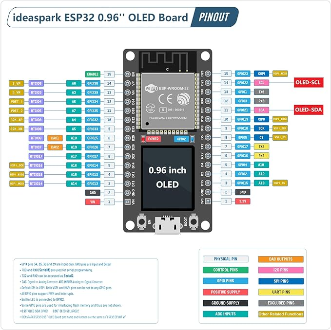

# ideaspark - ESP32 Development Board Integrated 0.96 Inch OLED Display

 - https://www.aliexpress.us/item/3256806082927592.html?gatewayAdapt=glo2usa4itemAdapt
 - https://www.amazon.com/ideaspark-Development-Integrated-Wireless-Micropython/dp/B0CN4F354N

## Project - Control OLED and onboard LED over Wi-Fi

I saw this ESP32 Devkit on Amazon and thought this could be an interesting package to use for exploring  Bluetooth and Wi-Fi control capabilities.

This is my first control project, I wanted to learn to control the integrated display and onboard LED over my local network via a web page served from the ideaspark package.

### Acknowledgements 

I started with the pinout sheet from Amazon shown here:

I got the OLED up and running using the adafruit SD1306 example and this link:

https://randomnerdtutorials.com/esp32-ssd1306-oled-display-arduino-ide/

One oddity the scrolldiag calls do not seem to work with this display on this Devkit.

The connecting animation was built from a bitmap found on https://icons8.com/.

I used these links to guide me on getting Wi-Fi and a web page up and running

https://esp32io.com/tutorials/esp32-controls-led-via-web

https://www.makerguides.com/control-esp32-via-wi-fi/

So far this package has provided a good learning experience, and I am looking forward to 
building out a Bluetooth control program.
